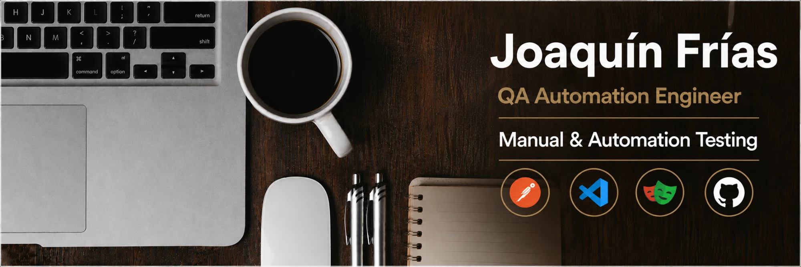

# Joaquín Frías · QA Automation Engineer

**Playwright · TypeScript · API testing · SQL**

📍 Formosa, Argentina · 🔎 Busco mi primera posición como **QA Automation Engineer**

---

## Sobre mí

Vengo de la calidad operativa: dos años como analista de calidad y back office en VN Global BPO, auditando procesos, validando datos contra reglas de negocio y documentando desvíos en entornos de alto volumen. Hoy llevo esa forma de trabajar a la automatización de pruebas.

- 🎓 Técnico Superior en Desarrollo de Software — Instituto Fermosa (2025)
- 🧪 QA Manual & Automation — Free Range Testers (2026)
- 📚 En formación intensiva en QA Automation

Trabajo como en un equipo real: criterios de aceptación primero, casos de prueba escritos antes de automatizar y, si un criterio no está claro, pregunto en lugar de automatizar a ciegas.

---

## Stack

| Nivel | Tecnologías |
|---|---|
| **Uso habitual** | Playwright, TypeScript, Git y GitHub |
| **En formación** (proyectos en preparación) | Page Object Model y fixtures avanzadas, testing de APIs (Postman y `request` de Playwright), SQL para validación de datos, GitHub Actions |
| **Nociones** | Selenium, Rest Assured (Java), HTML, CSS, JavaScript, PHP |

---

## Proyectos de QA

| Proyecto | Qué es |
|---|---|
| **Automation-Exercise-Integral-Testing** *(en construcción)* | Proyecto principal: estrategia de pruebas, E2E y API sobre [automationexercise.com](https://automationexercise.com), con framework escalable e integración continua. |
| [qa-automation-practice](https://github.com/joaquinfriass/qa-automation-practice) | Práctica diaria de automatización, organizada en cuatro hilos. Cada sesión deja un commit y una entrada en la bitácora. |

**Estado de `qa-automation-practice`:**
- ✅ **SauceDemo (UI):** casos de prueba documentados y tests del carrito con Playwright y TypeScript.
- 🔜 **Automation Exercise, Restful-Booker (API) y SQL:** hilos planificados; hoy solo tienen su README.

## Proyectos académicos

Proyectos de software desarrollados durante la **Tecnicatura Superior en Desarrollo de Software**. Son demos académicas, no productos para producción.

| Proyecto | Materia | Tecnologías |
|---|---|---|
| [MediAgenda](https://github.com/joaquinfriass/MediAgenda) | Prácticas Profesionalizantes II | C#, .NET 8, .NET MAUI, Entity Framework Core, SQLite (Android y Windows) |
| [SeguFor](https://github.com/joaquinfriass/Repositorio-SeguForApp) | Calidad de Software y Desarrollo de Aplicaciones Móviles | React Native, Expo, PHP, MySQL |

- **MediAgenda:** gestión de turnos médicos entre pacientes y profesionales: directorio de clínicas, filtro por especialidad, reserva y cancelación de turnos.
- **SeguFor:** aplicación móvil de seguridad personal con pantalla SOS, mapa, números de emergencia y reportes de incidentes de la comunidad, con panel web de administración.

---

## Certificaciones

Mis certificados de testing y desarrollo de software están en [Certifications](https://github.com/joaquinfriass/Certifications): fundamentos de testing, Postman, API con Rest Assured, Selenium y Cucumber, Playwright con TypeScript, Azure DevOps para testers, y formación en programación, bases de datos, Git y Java.

---

## Contacto

